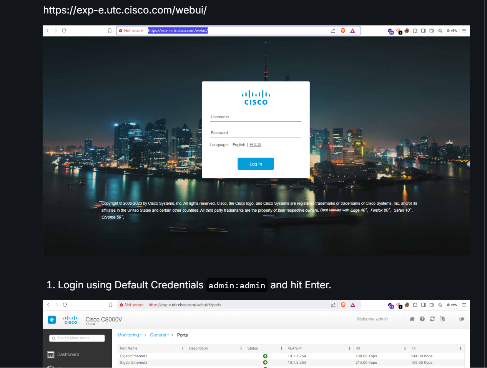
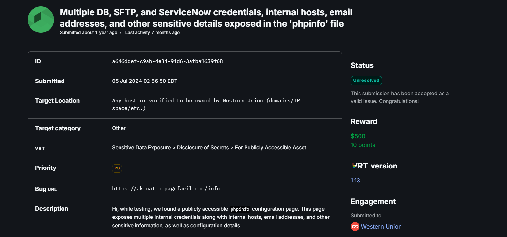

# Hi, I'm Dileep Chowdary 👋

Aspiring Security Engineer and Bug Bounty Hunter passionate about web application security, cloud security, and responsible disclosure. Currently pursuing my Master’s at the University of Alabama at Birmingham (UAB), I contribute to security programs and document my findings through blogs and PoCs.

---

## 💼 Key Experience

**APPSECREW** – Security Consulting intern performing security assessments on multiple client applications.  

**Mastercard** – Discovered and responsibly disclosed an Open Redirect vulnerability in the customer portal login flow.  
[Blog & Report](https://github.com/dileep800/Security/mastercard-open-redirect.md)  

**Recreation.gov** – Identified a GET-based Open Redirect vulnerability on a government portal, demonstrating phishing risks.  
[Blog & Report](https://github.com/dileep800/Security/recgov.md)  

**Other Projects** – Web application pentesting, cloud security audits, workflow automation, and security research.

---

## 🏆 Bug Bounty Highlights

- Recognized in **Mastercard** and **Recreation.gov** programs for responsible disclosure.  
- Hall of Fame mentions: Microsoft, Apollo, Cisco.

---

## 🛠️ Skills & Tools

- **Web Security:** XSS, Open Redirect, SSRF, CSRF  
- **Cloud Security:** AWS configurations, S3 bucket audits, IAM review  
- **Tools:** Nmap, ZGrab2, HTTPX, Assetfinder, Wireshark, Snort/Suricata, OpenSSL  
- **Scripting:** Python, Bash  
- **Documentation & Workflow:** Git, GitHub, Markdown

---

## 📊 Sample Workflow & Projects

Here’s an overview of my security workflow and projects:

  
  
  

Check out full repository here: [GitHub Projects](https://github.com/dileep800/Security)

---

## 🎓 Education

- Master’s in Cyber Security – University of Alabama at Birmingham (UAB)  

---

## 🔭 Current Work

- Hands-on labs with AWS, Kibana, and automated vulnerability scanning.  
- Writing blogs and PoCs for bug bounty programs to share responsible disclosure knowledge.

---

## 📫 Contact

- GitHub: [https://github.com/dileep800](https://github.com/dileep800)  
- Email: dileephackthebox@gmail.com

