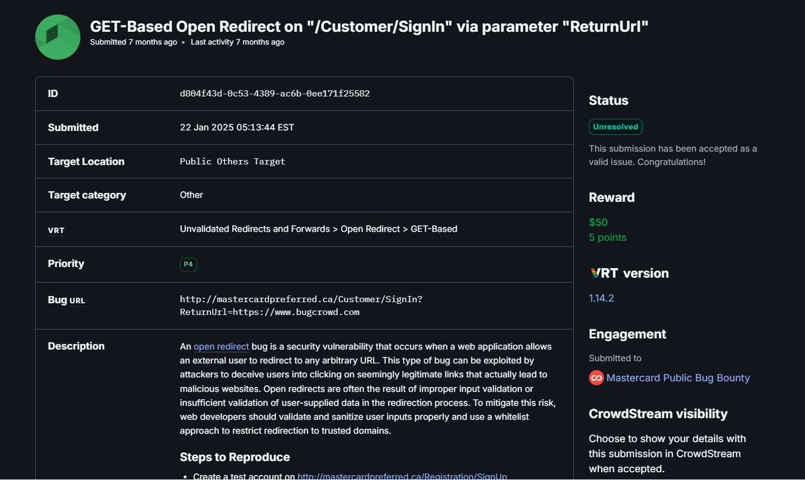

Mastercard Open Redirect – Turning Trust Against Itself

I was digging around Mastercard’s customer portal when I noticed something interesting in their login flow. The URL had a parameter called ReturnUrl. For bug hunters, this is like a flashing neon sign saying: “Test me!”.

The original link looked harmless:

http://mastercardpreferred.ca/Customer/SignIn?ReturnUrl=https://www.bugcrowd.com

Redirect parameters are often used after login to take users back where they came from. But if the app doesn’t validate them properly, you can send people anywhere you want.

🚀 Testing the waters

I replaced the value of ReturnUrl with my own domain:

http://mastercardpreferred.ca/Customer/SignIn?ReturnUrl=https://evil.com

Logged in, hit enter, and… boom. The site happily redirected me to evil.com without complaint.

That moment is always fun — when a small tweak proves the app trusts your input a little too much.

⚡ Why this matters

Some might call Open Redirects “low severity.” But combine this with a bit of social engineering and you’ve got a powerful phishing vector:

Trick a user with a legit Mastercard link.

They log in, thinking everything is normal.

Behind the scenes, they’re redirected to a fake page that looks exactly like Mastercard’s.

Credentials stolen. Game over.

It’s the classic wolf in sheep’s clothing.

🛡️ How to fix it

The fix isn’t complicated, but it’s crucial:

Validate ReturnUrl against a whitelist of approved domains.

Don’t trust external values when redirecting.

Sanitize inputs before processing them.

🎯 Takeaway

Sometimes, the “boring” bugs open the door to bigger attacks. An Open Redirect might look harmless in isolation, but paired with phishing, it becomes a serious security risk. This one reminded me that every parameter deserves a second look — you never know which one is hiding the treasure.
